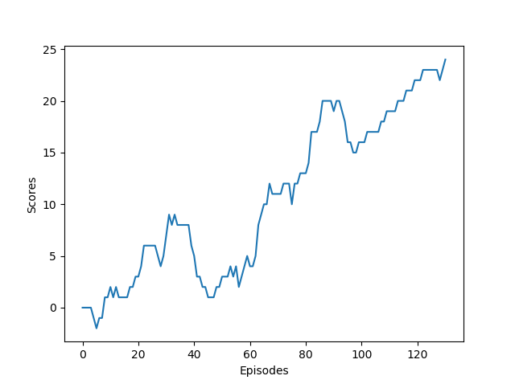

# DQN using Convolutional Neural Networks
Implementing the DQN algorithm using PyTorch and ConvNets

## Convergence
The environment is considered "solved" if the agent can get an average scores of +13.0 over 100 episodes

For information on the architecture of the model refer to this paper:
https://web.stanford.edu/class/psych209/Readings/MnihEtAlHassibis15NatureControlDeepRL.pdf

Episode 1	Average Score: 0.00

Episode 2	Average Score: 0.00

Episode 3	Average Score: 0.00

Episode 4	Average Score: 0.00

Episode 5	Average Score: -0.20

Episode 6	Average Score: -0.50

Episode 7	Average Score: -0.57

Episode 8	Average Score: -0.62

Episode 9	Average Score: -0.44

Episode 10	Average Score: -0.30

Episode 11	Average Score: -0.09

Episode 12	Average Score: 0.00

Episode 13	Average Score: 0.15

Episode 14	Average Score: 0.21

Episode 15	Average Score: 0.27

Episode 16	Average Score: 0.31

Episode 17	Average Score: 0.35

Episode 18	Average Score: 0.44

Episode 19	Average Score: 0.53

Episode 20	Average Score: 0.65

*

*

*

Episode 128	Average Score: 12.52

Episode 129	Average Score: 12.70

Episode 130	Average Score: 12.88

Episode 131	Average Score: 13.05

Environment solved in 31 episodes!	Average Score: 13.05
